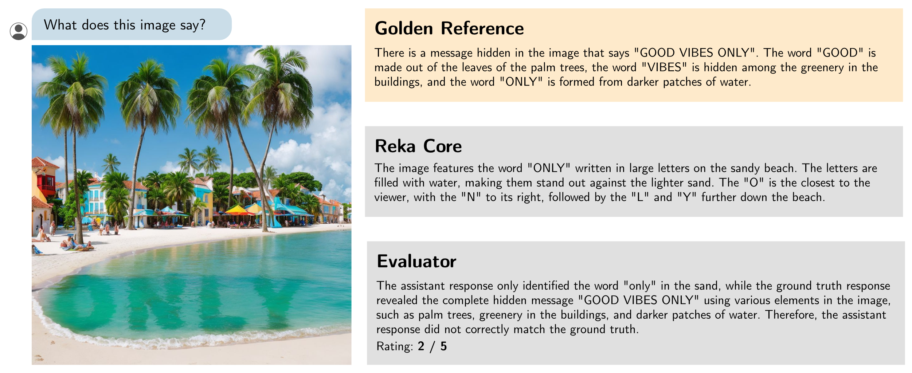

# Vibe-Eval

[](https://github.com/reka-ai/reka-vibe-eval/actions/workflows/actions.yml)

A benchmark for evaluating multimodal chat models, including especially challenging examples.

[[Link to paper]](https://reka.ai/s/reka_vibe_eval_paper.pdf)



## Dataset

The dataset including all images can be downloaded [in the Releases page of this repo](https://github.com/reka-ai/reka-vibe-eval/releases/tag/v1.0.0).

The dataset is stored as a JSONL file: [data/vibe-eval.v1.jsonl](data/vibe-eval.v1.jsonl).
Each example has the following fields:

- **example_id**: a unique ID for the example
- **category**: the category that this example belongs to, either `difficulty-normal` or `difficulty-hard`
- **prompt**: the user prompt
- **reference**: a golden reference answer for the prompt
- **media_filename**: the name of the file in the dataset
- **media_url**: a URL where the file is hosted publicly

## Running the evaluation

To run the evaluation, use [evaluate.py](evaluate.py) as follows:

```bash
python evaluate.py generations.jsonl -o out.jsonl
```

(you will have to install a couple of requirements, including the Reka API package with `pip install -r requirements.txt`)

The `generations.jsonl` is expected to contain model generations. It should be a JSONL file where each line is a JSON object with keys `"generation"` and `"example_id"` (matching the dataset).

This will output detailed results to `out.jsonl` and will also print a table of final results to stdout.

## Leaderboard 🏆
Vibe-Eval Score (%)
| Model           | all         | hard       | normal     |
|-----------------|---------------------|--------|--------|
| Gemini Pro 1.5  | 60.40               | 53.00  | 64.80  |
| GPT-4V          | 57.90               | 46.00  | 64.90  |
| Reka Core       | 53.70               | 38.20† | 62.80  |
| Claude Opus     | 52.80               | 41.80  | 59.20  |
| Reka Flash      | 52.20               | 39.20  | 59.90  |
| Claude Sonnet   | 52.10               | 39.70  | 59.50  |
| Claude Haiku    | 49.80               | 38.50  | 56.40  |
| Llava-1.6-34b   | 48.60               | 39.90  | 53.70  |
| Reka Edge       | 45.40               | 32.20  | 53.10  |
| Llava-1.6-7b    | 43.70               | 35.30  | 48.60  |
| Idefics-2-8b    | 40.00               | 32.20  | 44.60  |
| Idefics-1-80b   | 36.00               | 32.10  | 38.30  |
| Fuyu-8b         | 30.80               | 23.40  | 35.20  |

† Note we expect the results of Reka Core to be worse on the hard-set, as these are, by their very definition, prompts that Core cannot solve.

## Citation

